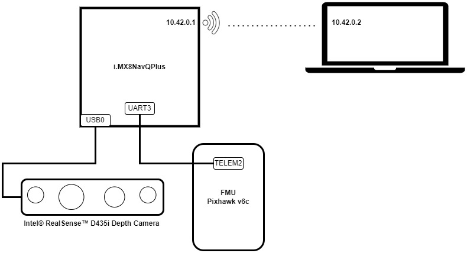
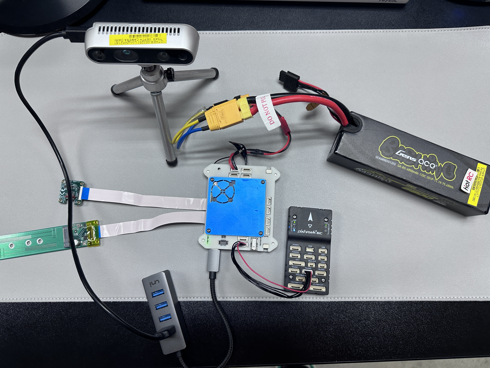

# Overview

This document to show how to install and integrate the kr_autonomous flight stack with IntelRealsense D435i Depth Camera
on the i.MX8 NavQPlus

# Install the Dependencies

1. Install MAVROS

   - Install the mavros packages using command:

     `sudo apt install ros-noetic-mavros*`
   - Install the geographiclib dataset:

     `sudo /opt/ros/noetic/lib/mavros/install_geographiclib_datasets.sh`
2. Install Dependencies

   ```
   sudo apt install ros-noetic-smach* ros-noetic-angel ros-noetic-tf* ros-noetic-rviz* ros-noetic-pcl* libfmt-dev \
                    python3-catkin-tools python3-rosdep python3-rosinstall python3-vcstool \
                    ros-noetic-twist-mux ros-noetic-vision-msgs python3-yaml \
                    python3-pycryptodome python3-gnupg libsuitesparse-dev libv4l-dev libceres-dev \
                    ros-noetic-random-numbers libsdl-dev libsdl-image1.2-dev \
                    ros-noetic-gazebo-ros ros-noetic-image-geometry ros-noetic-depth-image-proc
   ```

# Building kr_autonomous_flight

## Ground Station

1. Create a folder for your work environment, and clone the repo inside

   ```
   mkdir -p ~/catkin_ws_kr/src
   cd ~/catkin_ws_kr/src
   git clone https://git3.fsoft.com.vn/GROUP/DAP1UAVFP/autonomous-flight-stack/autonomous-flight-stack.git
   ```
2. Get the dependencies

   ```
   cd ~/catkin_ws_kr/src/kr_autonomous_flight
   vcs import < external_all.yaml
   vcs pull
   cd ../..
   ```
3. Build the source

   ```
   catkin config --cmake-args -DCMAKE_BUILD_TYPE=Release
   catkin build
   ```

   ***Note: Because of using multithread for building, when there are issues related to 1 of dependency modules, let the
   catkin done the build with error then try to run `catkin build` again

## Companion Computer

1. Create a folder for your work environment, and clone the repo inside

   ```
   mkdir -p ~/catkin_ws_kr/src
   cd ~/catkin_ws_kr/src
   git clone https://git3.fsoft.com.vn/GROUP/DAP1UAVFP/autonomous-flight-stack/autonomous-flight-stack.git
   ```
2. Get the dependencies

   ```
   cd ~/catkin_ws_kr/src/kr_autonomous_flight
   vcs import < external_all.yaml
   vcs import < external_real_robot.yaml
   rm -r ouster_example
   vcs pull
   cd ../..
   ```
3. Build the source

   ```
   catkin config --cmake-args -DCMAKE_BUILD_TYPE=Release
   catkin build
   ```

   ***Note: Because of using multithread for building, when there are issues related to 1 of dependency modules, let the
   catkin done the build with error then try to run `catkin build` again

# FMU Configuration

1. Need to enable MAVLink on a configurable serial port (TELEM2).
   - Connect the Pixhawk flight controller to QGroundControl via USB or Telemetry (TELEM1),
     so that you can change parameters in the parameter table and push them to the vehicle.
   - Set param MAV_1_CONFIG = TELEM 2 (MAV_1_CONFIG is often used to map the TELEM 2 port)
   - Reboot the vehicle to make other parameters visible.
   - Set the remaining parameters if not being set by default.

     `MAV_1_MODE = Onboard`

     `SER_TEL2_BAUD = 921600`
2. Once this parameter is enabled, when Pixhawk is powered on, it will automatically broadcast messages (drone status)
   via TELEM2 port. The RX indicator should be flickering accordingly.

# Hardware Connection

Connect the hardwares as the picture below:



Real hardware connection as below:



In this setup, the Companion (iMX8) will use the WiFi in AP mode.
Please follow the step at https://github.com/KumarRobotics/kr_autonomous_flight/wiki/WiFi-Network for more detail.

# Launching Experiment

The record video of gazebo simulation, KR autonomous with depth camera on Ubuntu Laptop and i.MX8NavQPlus is available at autonomous-flight-stack/record

## Companion Computer

1. Export the enviroment

   ```
   source ~/catkin_ws_kr/devel/setup.bash
   export ROS_MASTER_URI="http://10.42.0.1:11311/"
   export ROS_HOSTNAME="10.42.0.1"
   ```
2. Launch the kr_autonomous_flight using command:

   `roslaunch real_experiment_launch full_autonomy.launch`

## Ground Station

1. Export the enviroment

   ```
   source ~/catkin_ws_kr/devel/setup.bash
   export ROS_MASTER_URI="http://10.42.0.1:11311/"
   export ROS_HOSTNAME="10.42.0.2"
   ```
2. Launch the kr_autonomous_flight client using command:

   `roslaunch client_launch client.launch`
