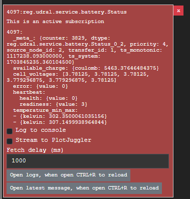
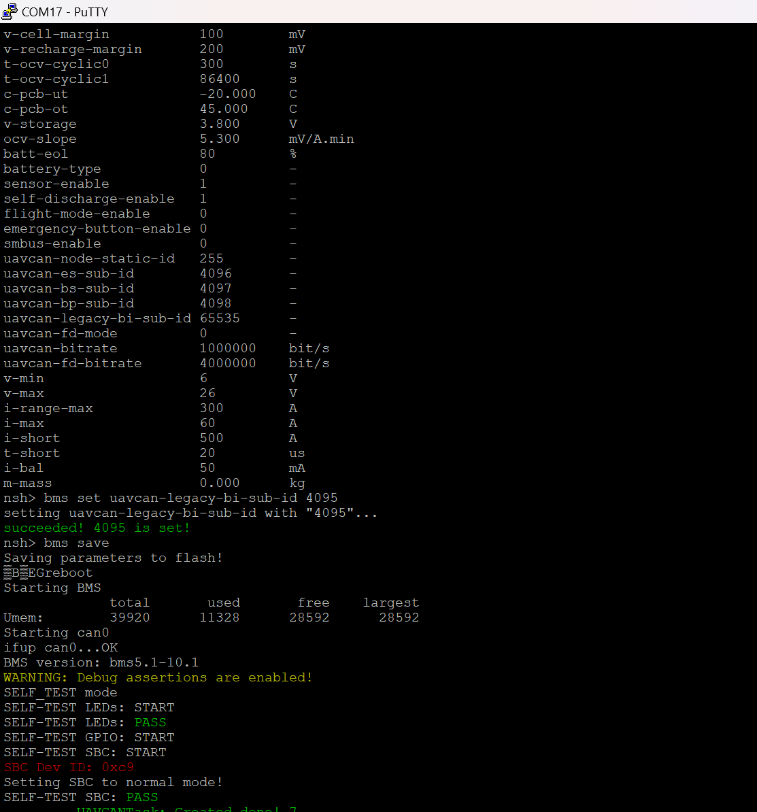

# BMS Cyphal getting started

This document to show how to integrate RDDRONE-BMS772 module into Cyphal with FMU - PX4 firmware and QGroundControl application

## Hardware connection

Please refer to "General setup" session

## Cyphal configuration

Ideally, you have done hardware connections where RDDRONE-BMS772 is connected to FMU via CAN.

### Yukon

1. Open Yukon application on your PC. Start a transport with SLCAN - by Zubax babel.
2. Follow the readme from FMU, path ./FMU/Readme.md to load .yaml configuration file in ./FMU/Config/FMU.yaml for integrating RDDRONE-BMS772 and FMU.
3. After load configuration, then RDDRONE-BMS772 and FMU are connected together.
4. Create a subscriber to monitor the BMS data - subject ID 4097 for example on Cyphal. We would see cells voltage, temperature information, etc.



### RDDRONE-BMS772 Serial console

1. Open a serial console with the configuration as following.


2. To show all parameters on BMS, command "bms get all".


3. To configure a parameter, command "bms set (parameter) (value)". Basically, at least we have to configure 5 parameters as below:

- n-cells, type the command: "bms set n-cells 6"
- uavcan-es-sub-id, type the command: "bms set uavcan-es-sub-id 4096"
- uavcan-bs-sub-id, type the command: "bms set uavcan-bs-sub-id 4097"
- uavcan-bp-sub-id, type the command: "bms set uavcan-bp-sub-id 4098"
- uavcan-legacy-bi-sub-id, type the command: "bms set uavcan-legacy-bi-sub-id 4095"

 Example:
 Configure the parameter "uavcan-legacy-bi-sub-id"



### QGroundControl

1. On home screen, the battery information is shown as bellow, it's over Cyphal with index 255.


2. Go to "Parameters" in "Vehicle setup" to see configuration of FMU's Cyphal.


## Extra communications

### NFC

Can use any NFC tool available on store. In phase 1, we use NFC- Reader & Writer available on App Store - Apple. Link: https://apps.apple.com/us/app/nfc-reader-writer/id1527949024

Go to read tab on the application. Put the phone on the onboard NFC antena


### I2C - SMBus

Ideally, you have done hardware connections where RDDRONE-BMS772 is connected to FMU via I2C.

1. Configure the BMS for I2C connecting:


2. To show all parameters on BMS, command "bms get all".


3. Configure the BMS for I2C connecting:

Enable temperature sensor with parameter sensor-enable :

```
bms set sensor-enable 1
```

Enable SMBus with parameter smbus-enable:

```
bms set smbus-enable 1
```

Save the configuration to flash to enable as default in next boot:

```
bms save
```

The console expected output is as below:


4. Configure the FMU:

Connect the FMU to PC and open QGroundControl with MAVLink Console.

Check the I2C connection between FMU and BMS:

```
i2cdetect -b 3
```

The FMU will regconize the BMS at address 0x08:


Start the BMS application:

```
bms_smbus start -X -b 3
```


Get all the information support by RDDRONE-BMS772

```
bms_smbus get_all
```


Check the uORB message:


Check the Battery Status


## References:

- https://github.com/NXPHoverGames/GitBook-BMS772
- https://nxp.gitbook.io/rddrone-bms772/
- https://github.com/NXPHoverGames/RDDRONE-BMS772
