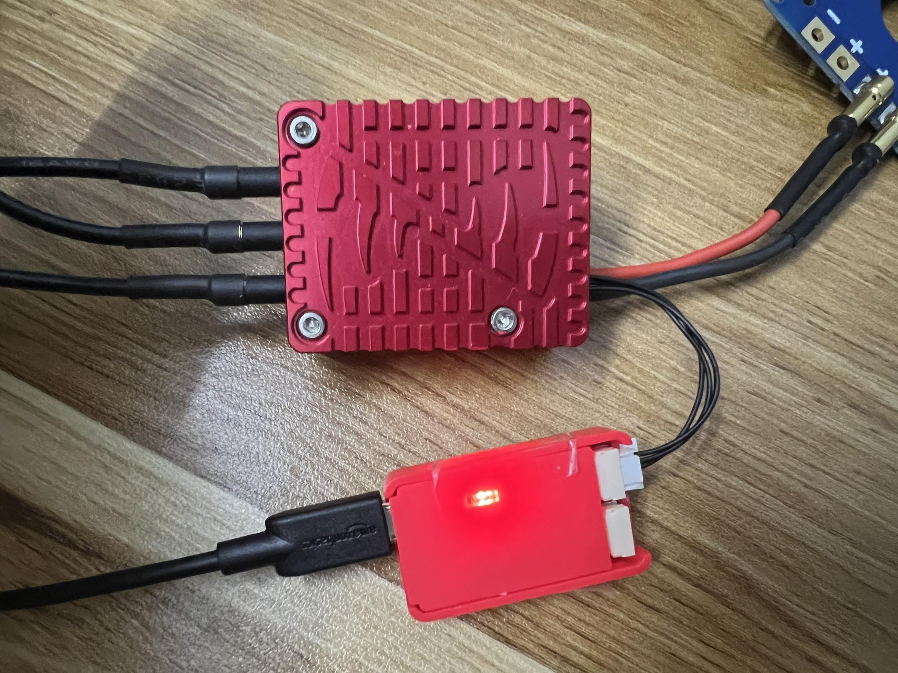

# ESC Cyphal integration
## 1. Hardware connection
* Diagram

* Hardware connection

## 2. Cyphal configuration
### 2.1 Configure the ESC
* Step 1: Connect USB to CAN module to a Zubax Myxa ESC via CAN port. We need to power the ESC from the Micro-USB or the output power port from BMS

* Step 2: Open Yukon tool, in Transports, choose CAN -> SLCAN -> Pick the COM port -> Start this transport. The ESC node will be appeared in the Monitor tab

* Step 3: Go to the Yukon's register page, right click on the ESC node, choose "Apply config from file". Then choose the YAML config file for ESC #1 [/Config/ESC1.yaml](./Config/ESC1.yaml)

* Step 4: Go to the Yukon's monitor page, then click on the MotorID of the recently ESC. The ESC's Mode will show as MAINTAINANCE (the motor will spinup slowly), wait till it changed back to NORMINAL and then click on Save.

* Step 5: Repeat the steps above for all the left Myxa ESCs. We have 4 YAML files for each ESC. Basically, they have the same parameters but different:

    * Node ID: uavcan.node.id - Node ID.
    * Setpoint Index: mns.setpoint_index - Index of the setpoint value in array-typed setpoint topics.
    * Some subscriber message for feedback data.

* **NOTE:** You can configure any node manually by double click on the node, input value needed and click "Submit" to apply the new value

### 2.2 Configure the FMU

If you already apply the FMU YAML config file from the FMU guidelines, you can skip step 1 to 3.

In case you want to configure it manually, please follow up these steps:

* Step 1: Connect the FMU with the USB to CAN module via CAN port
* Step 2: Open Yukon tool and start the transport as same as the above
* Step 3: When the FMU node have appeared on the Monitor tab, input the subject id for the udral.esc.0 and then enter

* Step 4: Plug-in the FMU to the PC, open QGroundControl to configure the motor. In Actuators -> Actuator Outputs -> UAVCANv1 -> Enable the ESC from 1 to 4:

## 3. Test

**WARNING** We have an issue with Zubax ESCs: whenever the readiness status is changing to 3 (ENGAGED), every motors will spinup and then stop continously even if the torque value is still equal to 0 (0%). So if you test a motor, other motors will spinup and then stop continously.

### 3.1 Verify FMU's publish data for ESC

* On the Monitor tab, right click -> Add a subscriber -> Input topic ID -> Use complex datatype selection -> Select any found DSDL datatype: reg.udral.service.actuator.common.sp.Vector31 -> Subscribe

* Data publish from the FMU for ESC will show in this dialog

### 3.1 Motor testing with QGroundControl

* Connect all the ESCs, FMU together as well as the motors and power it with a switching power supply or a battery.

* Open QGroundControl and go to the Actuators -> Enable Actuator Testing.

**Careful: Need to keep the motor in a test stand and remove all the propellers before start the test.**

* Pull each motor up and the motor will be ran. It will be ran with the max current that we set in the YAML config files because of the wrong set point scale issue that I mentions above. So please careful. To be safe, you can set the max current to 5A or even less than that by re-configure the motor.current_max register from 20 to 5

* Here is the video for testing the ESC control the motor: [Video](./Record/Actuator-testing.mp4)
