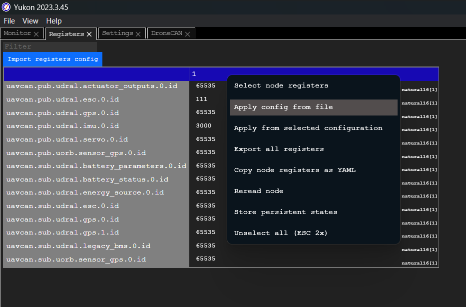
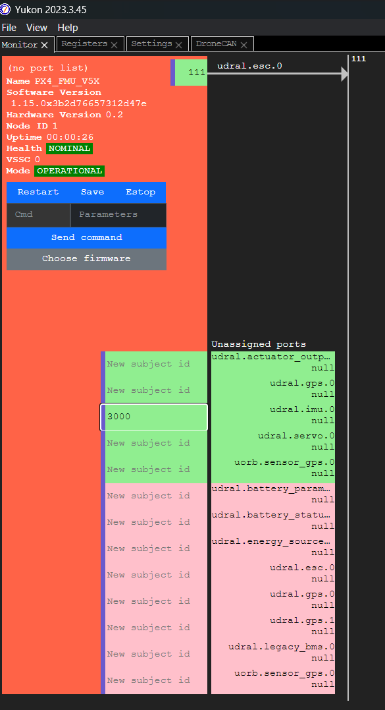
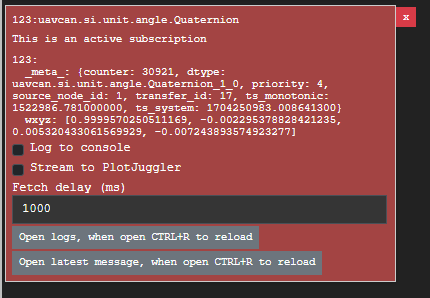
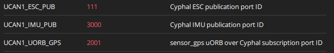

# FMU Cyphal integration
This document to show how to implement a Cyphal publisher into PX4 - Autopilot source code. 

Please refer to the branch "UAVCAN-Release-P1_0" of this repo to see the implementation:

https://git3.fsoft.com.vn/GROUP/DAP1UAVFP/PX4-Autopilot/px4-autopilot/-/tree/UAVCAN-Release-P1_0


* **NOTE:** The configuration is only available for Pixhawk FMU-V5x.
## 1. Hardware connection
Please refer to "General setup" session

## 2. Building the code
To build for NuttX- or Pixhawk- based boards, navigate into the PX4-Autopilot directory and then call make with the build target for the board FMU-V5x
```
make px4_fmu-v5x_default
```
## 3. Cyphal configuration

### 3.1 Config all FMU's register with YAML config file

* To complete FMU Cyphal configuration (with GNSS, ESC, BMS and IMU), open Yukon's register tab, right click on the FMU node, choose "Apply config from file". Then choose the YAML config file for the FMU [/Config/FMU.yaml](./Config/FMU.yaml)

<a style="padding:100px"></a>

* You can see all topics connected by the FMU via Yukon monitor tab

<a style="padding:100px"></a>

### 3.2 Manual config via Yukon

* Step 1: Connect the FMU with the USB to CAN module via CAN port
* Step 2: Open Yukon tool and start the transport as same as the above
* Step 3: When the FMU node have appeared on the Monitor tab, input the subject id for the udral.imu.0 and then enter

<a style="padding:100px"></a>

* **Status:** Subscribe IMU node on Yukon and visualize data

<a style="padding:100px"></a>

## 4. Test
### QGroundControl
Go to "Parameters" in "Vehicle setup" to see configuration of FMU's Cyphal.


