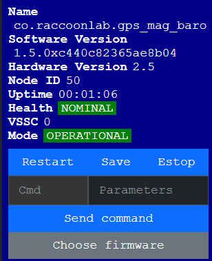
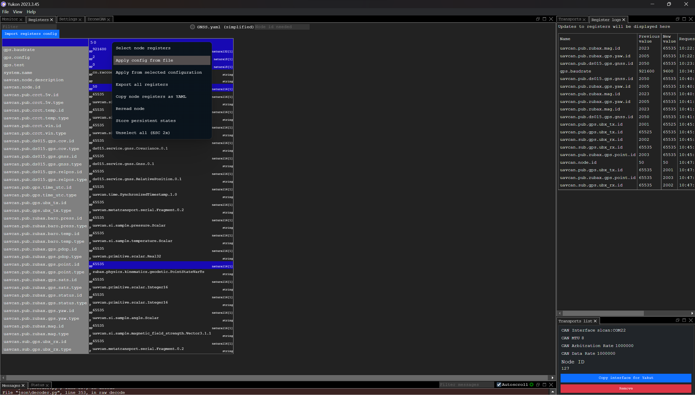
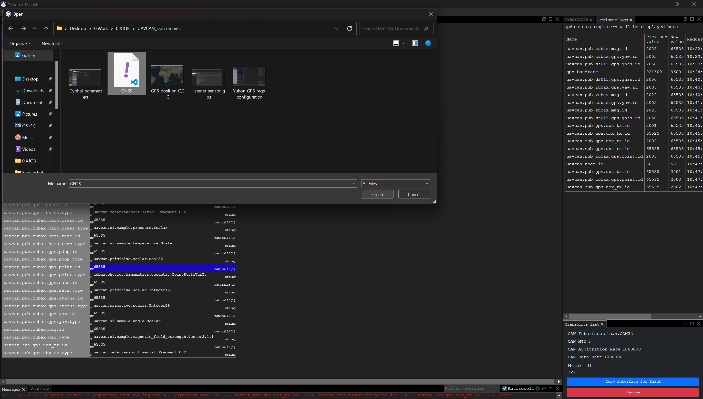
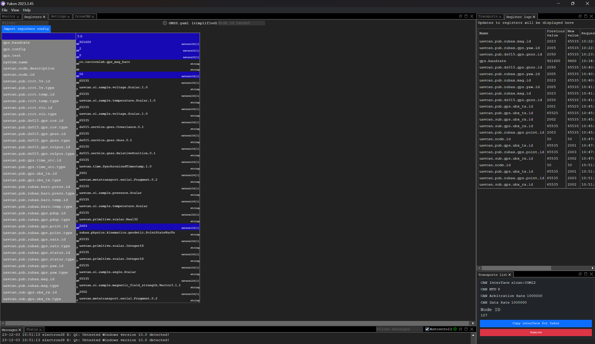
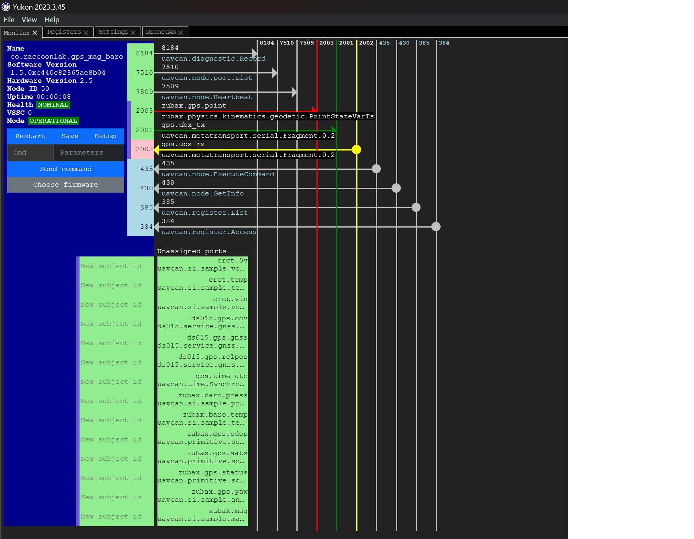
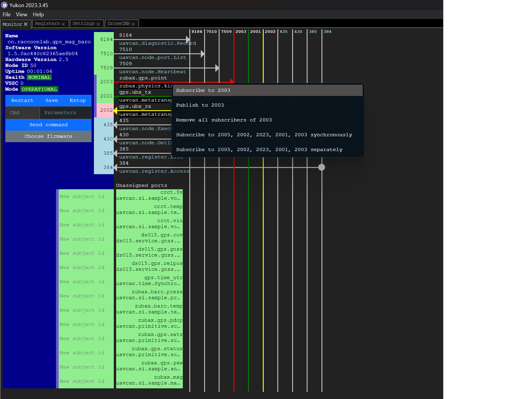
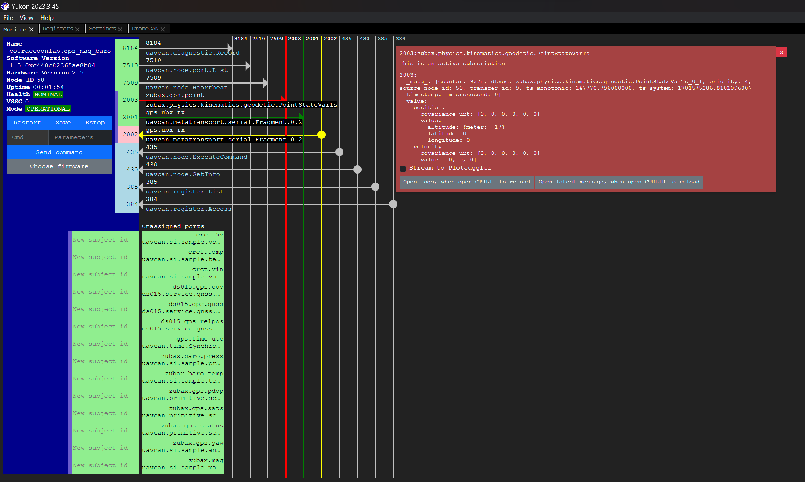
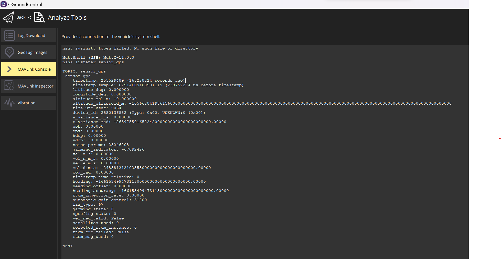
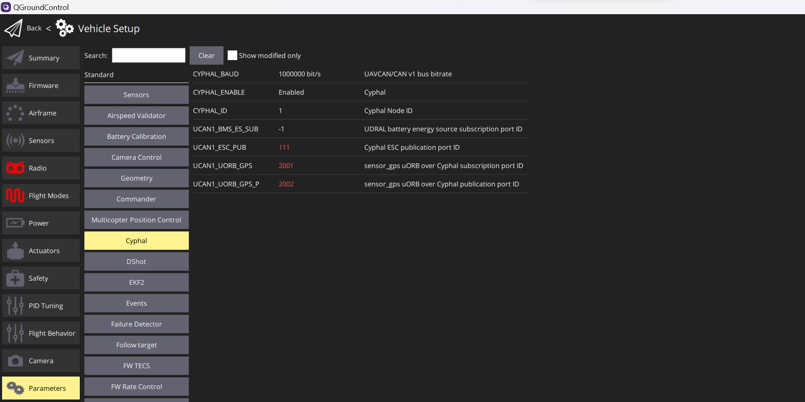

# GNSS Cyphal getting started
This document to show how to integrate Raccoonlab GNSS module into Cyphal with FMU - PX4 firmware and QGroundControl application
* Note: There is a problem with Raccoonlab GNSS module. GPS location data is not correct (-longitude and latitude are all zero at all time) while integrating Cyphal on the system. 

## Hardware connection
Please refer to "General setup" session

## Cyphal configuration
Ideally, you have done hardware connections, Zubax babel is connected to PC and DSDL is configured on Yukon application (about DSDL setting, please refer to link https://github.com/OpenCyphal/yukon).

### Yukon
1. Open Yukon application on your PC. Start a transport with SLCAN - by Zubax babel. 

2. Then go to "Monitor" tab, the Raccoonlab GNSS would be displayed.

3. Then go to "Registers tab". Right click on node id. Choose "Apply config from file".

4. Select to open file name "GNSS.yaml" - stored in path "./Config/GNSS.yaml"

5. Configuration parameters will be loaded in registers.

6. Go back to "Monitor" tab, some subjects is loaded successfully as .yaml file.

7. To subscribe the topic of GPS location, right click on subject name "zubax.gps.point" which is configured subject id 2003 as the picture. Then GPS data will be shown on subscriber screen.

### QGroundControl
1. On home screen, the map is showing GPS point.

2. We can go to "MAVLink console", type "listener sensor_gps" and press Enter to see the data retrieved on FMU side.

3. Go to "Parameters" in "Vehicle setup" to see configuration of FMU's Cyphal.

## References:
- https://docs.raccoonlab.co/guide/