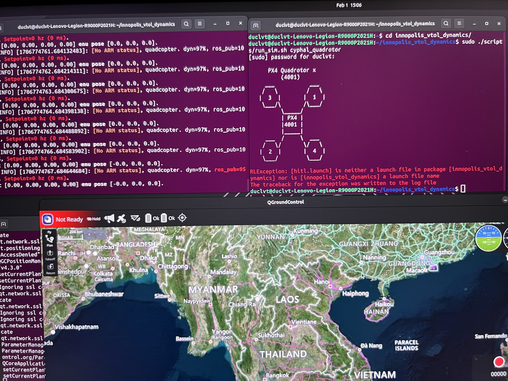

# HITL Guidelines
## 1. Resource:
* UAV HITL Dynamics Simulator:
    * Please refer guidelines from this repo: [https://github.com/ZilantRobotics/innopolis_vtol_dynamics](https://github.com/ZilantRobotics/innopolis_vtol_dynamics)
    * Cyphal guidelines: [https://github.com/ZilantRobotics/innopolis_vtol_dynamics/blob/master/docs/px4/cyphal.md](https://github.com/ZilantRobotics/innopolis_vtol_dynamics/blob/master/docs/px4/cyphal.md)
* 3D simulator:
    * Latest master from innopolis_vtol_dynamics said that the 3d simulator will coming soon.

* Hardware connection
    * Connect FMU + Zubax babel and telemetry together!

## 2. Additional Steps
* Step 1: PX4 doesn't fully support the Cyphal UAV HITL simulation right now. We have to choose one out of these following ways:

    * 1. Config and enable cyphal for your FMU from this PR's branch: [https://github.com/PonomarevDA/PX4-Autopilot/tree/pr-cyphal](https://github.com/PonomarevDA/PX4-Autopilot/tree/pr-cyphal)

    * 2. Use latest master from FPT PX4 repo.

### NOTE: As of now, both of these two can not work properly. This will be fixed in the next phase.

* Step 2: Disable firmware upload on this file if you not using FMU-V5: innopolis_vtol_dynamics/scripts/configure.sh

## 3. Demo
* Log dump after start the simulator

<a style="padding:100px"></

* Here is the some videos:

* Video 1: [video](./Record/3862686855741484897.mp4)

* Video 2: [video](./Record/151371200687429761.mp4)

* Video 3: [video](./Record/8670366948922472735.mp4)

### NOTE: 3D simulator is not supported, but older version suggest we use this tool [https://github.com/inno-robolab/InnoSimulator](https://github.com/inno-robolab/InnoSimulator)

* We have tried to use the tool to simulation the drone but still failed. We will try to fix it in the next phase!
